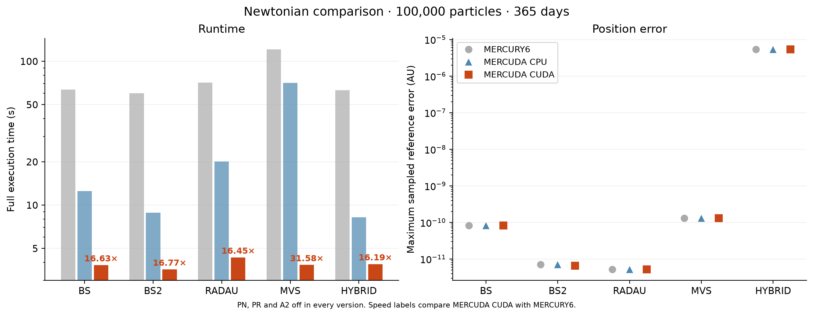

# MERCUDA

A derivative of John E. Chambers' **MERCURY6** with GPU acceleration for BS,
BS2, RADAU, MVS and HYBRID, solar 1PN relativity, radiation pressure and
Poynting–Robertson (PR) drag, and Yarkovsky drift. CPU mode also includes
performance and integration fixes.

## Quick start for MERCURY6 users

Keep your usual `.in` files and run the same programs without new command line
options. The additional choices are:

1. **Build:** `make` includes GPU support if it finds NVIDIA's CUDA toolkit
   (`nvcc`); otherwise it builds CPU only. `make cpu` forces a CPU-only build.
   Use `make clean-build` before changing build settings; it keeps simulation files.
2. **Enable GPU:** append this line **after all existing settings** in `param.in`:

   ```text
    execution backend = cuda
   ```

   CPU is the default if omitted; `auto` chooses a backend by particle count and
   availability. CUDA needs an NVIDIA GPU, driver and toolkit.
3. **Check force settings:** relativity (PN) uses the existing switch. Yarkovsky
   uses `yar=<value>` on the body's parameter line in `big.in` or `small.in`
   (AU/day² at 1 AU; default zero). PR uses `b=<beta>` for massless bodies.
   **Use BS or RADAU for PN, PR or Yarkovsky.** `A1`, `A2` and `A3` retain
   their original cometary meaning. Change earlier MERCUDA Yarkovsky inputs
   from `A2` to `yar`.
4. **Run:** `./mercury6`, then `./element6` or `./close6` as usual. Check
   `info.out` to confirm CPU or CUDA actually ran. Custom `mfo_user` forces need CPU.
5. **Restart or rerun:** dynamics still come from dumps; only the backend can be
   overridden in ordinary `param.in`. Earlier MERCUDA dumps migrate automatically;
   unversioned legacy dumps with PN are incompatible.
   To rerun from the inputs, run `make rm-gen`, which deletes outputs and dumps;
   save results first. **`make clean` also deletes `.in` files.**

## Documentation

- **[MERCUDA guide](README_MERCUDA.md)** — a first run, GPU setup, force settings and restarts.
- **[MERCURY6 manual](README_MERCURY6.md)** — standard inputs, outputs, postprocessing and restarts, adapted for this package. The unmodified original is in [mercury6.man](mercury6.man); its build instructions do not apply.
- **[Technical notes](docs/technical_notes.md)** — equations, integration changes and CUDA implementation.
- **[Benchmarks](docs/benchmarks.md)** — accuracy, runtime, particle-count and integration-time scaling.
- **[Validation](docs/validation.md)** — regression tests, independent accuracy checks and coverage limits.
- **[References](docs/references.md)** — integrator and force-model literature.

## Performance



In this stable-orbit example, MERCUDA CUDA is **16–32× faster than original
MERCURY6**, with similar endpoint accuracy: eight planets, 100,000 massless
particles, 365 days, extra forces off, RTX 4070 versus one i5-13600KF CPU thread.
The speedup includes CPU improvements; small or short runs can favor CPU.
[Full results, matched-force comparisons and methodology](docs/benchmarks.md).

## Citation

Please cite [Chambers (1999)](https://doi.org/10.1046/j.1365-8711.1999.02379.x)
and record the MERCUDA revision and force settings used.
[Additional references](docs/references.md) · [Original MERCURY6 repository](https://github.com/smirik/mercury).
