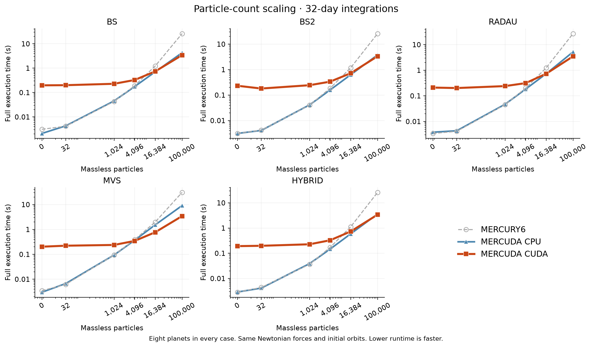
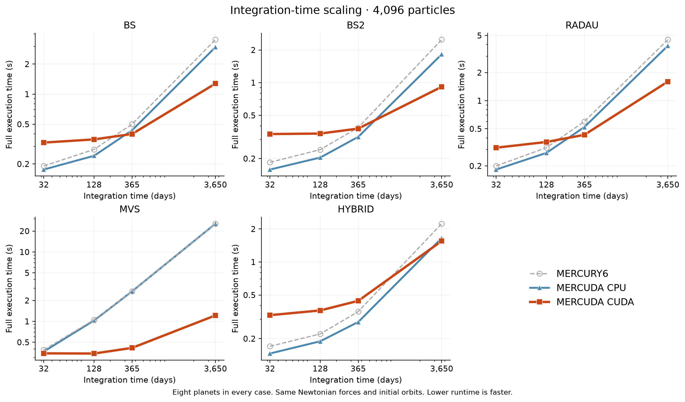
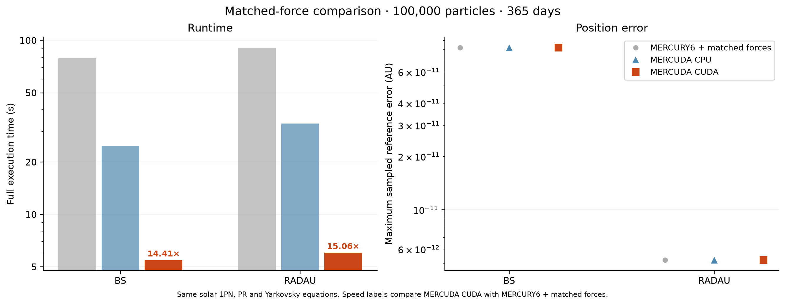

# Benchmarks

[MERCUDA overview](../README.md) · [Usage guide](../README_MERCUDA.md)

These figures were measured with force model 1 at the revision recorded below.
That version called the Yarkovsky coefficient `A2`; equivalent inputs now use
`yar` with cometary `A2=0`. Historical results and labels are retained; the
figures have not been rerun for this input change.

These measurements compare **identical Newtonian physics**, with solar 1PN
relativity (PN), radiation pressure/PR drag, A1/A2/A3 and oblateness disabled.
The example below uses eight planets and 100,000 massless particles for 365 days;
timings include startup and final output.

| Algorithm | MERCURY6 CPU | MERCUDA CPU | MERCUDA CUDA | MERCURY6 / CUDA | MERCUDA CPU / CUDA | MERCURY6 error (AU) | CUDA error (AU) |
| --- | ---: | ---: | ---: | ---: | ---: | ---: | ---: |
| BS | 63.7 s | 12.6 s | 3.83 s | 16.63× | 3.28× | 8.27e-11 | 8.22e-11 |
| BS2 | 59.9 s | 8.89 s | 3.57 s | 16.77× | 2.49× | 7.04e-12 | 6.6e-12 |
| RADAU | 71.2 s | 20.1 s | 4.33 s | 16.45× | 4.65× | 5.2e-12 | 5.18e-12 |
| MVS | 121 s | 70.8 s | 3.84 s | 31.58× | 18.42× | 1.31e-10 | 1.31e-10 |
| HYBRID | 63.1 s | 8.25 s | 3.89 s | 16.19× | 2.12× | 5.41e-06 | 5.41e-06 |

Errors are maximum absolute Cartesian endpoint differences against a converged
REBOUND IAS15 reference, over eight planets and up to 64 sampled particles.
All-particle CPU/CUDA comparisons were also checked. The plotted cases show
similar accuracy, not a guarantee for every orbit or encounter. BS2's corrected
error norm can change timesteps even at equal requested tolerance.

The speedup over MERCURY6 includes CPU initialization improvements as well as
CUDA acceleration; the CPU/CUDA column separates the backends more closely.
Small/short runs can favor CPU. [Particle-count and duration plots](#particle-count-and-duration)
show the dependence on workload.

For a fair additional-force comparison, a separate **MERCURY6 + matched forces**
baseline retains the original integrators/controllers but installs the same PN,
PR and A2 equations and their input activation. Original unmodified MERCURY6's
PN and PR routines are placeholders. With solar 1PN and particle beta=1e-4,
A2=1e-12 AU/day² in the same 100,000-particle, 365-day case:

| Algorithm | MERCURY6 + matched forces | MERCUDA CPU | MERCUDA CUDA | Baseline / CUDA | Baseline / CUDA error (AU) |
| --- | ---: | ---: | ---: | ---: | ---: |
| BS | 78.8 s | 24.8 s | 5.47 s | 14.41× | 8.23e-11 / 8.23e-11 |
| RADAU | 90.9 s | 33.4 s | 6.04 s | 15.06× | 5.21e-12 / 5.21e-12 |

The force-enabled reference uses independent IAS15 stepping with the validated
MERCUDA heliocentric force implementation. It tests integration accuracy under
the same prescription, not an independent implementation of that prescription.
PN, PR and A2 are enabled together; these timings do not isolate PN's cost.

**Measurement scope:** RTX 4070 and one pinned i5-13600KF CPU thread, Linux/WSL,
gfortran 13.3.0, CUDA 12.6; median of three fresh executions after one warmup.
Adaptive tolerance 1e-11, fixed timestep one day, high precision, final-epoch
output. Synthetic eight-planet system; particles start at perihelion with random
azimuths, a=3.2–3.8 AU, e=0.01–0.05 (seed 1729). Scaling sweeps span
0–100,000 particles and 32–3,650 days. These are stable-orbit benchmarks.

MERCUDA was measured at [7e0084d](https://github.com/HBJ1004/MERCUDA/commit/7e0084de7af16fbaaa1b7d7d4c1cfc6717e668d3).
Original [MERCURY6 source](https://github.com/smirik/mercury/tree/aee9e0f6b8e4d359a9ed3607ee12e34a2e2dafac)
was changed only to raise NMAX from 2,000 to 100,010 for the Newtonian runs.
The matched-force baseline additionally changes only MFO_PN, MFO_PR, MFO_NGF
and MIO_IN (force equations, PN parsing and combined A2/PR activation).
IAS15 tolerances 1e-13 and 1e-15 agreed within 2.57e-13 AU across the campaign.
All 156 configuration aggregates completed, with identical endpoints across
repeated executions of each configuration; the largest all-body CPU/CUDA
position difference was 3.79e-11 AU. Only the final figures are published;
benchmark scripts, reference builds and simulation files are not part of the
package.

## Particle count and duration

The figures below show how total runtime changes with particle count and duration.
They use identical initial states between implementations at each configuration.

Eight planets and 0–100,000 massless particles, integrated for 32 days.

Eight planets and 4,096 massless particles, integrated for 32–3,650 days.

100,000 massless particles plus eight planets for 365 days, with identical solar
1PN, beta=1e-4 and A2=1e-12 AU/day². The patched MERCURY6 baseline retains its
original integration controllers; the IAS15 reference shares the validated
heliocentric force implementation, so this checks integration accuracy rather
than providing an independent derivation of the forces.

Speed depends on hardware, algorithm, population, encounters and output cadence.
Startup can dominate short runs. These stable-orbit measurements do not establish
universal accuracy equivalence. An earlier, unpublished benchmark campaign found
MVS accuracy differences in some other configurations. Check convergence for your
intended problem.
